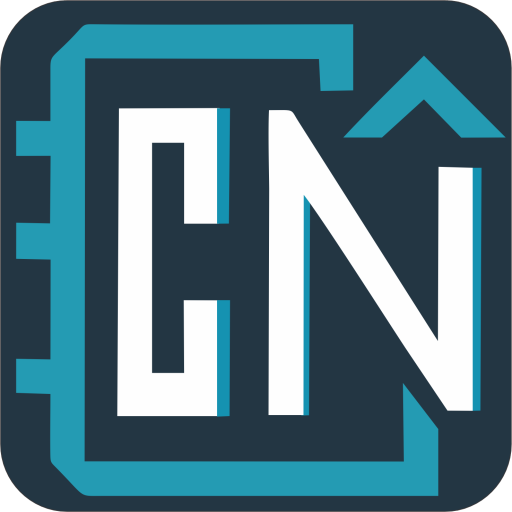

# CyberNotes 🚀

**CyberNotes** is a premium, secure, and privacy-focused note-taking application designed for the modern user. Built with Electron, React, and SQL.js, it offers a high-performance experience with a stunning "Cyber" aesthetic.



## ✨ Key Features

- **Privacy First**: Local-only database powered by SQL.js. Optional master password protection with bcrypt encryption.
- **Rich Text Editing**: Advanced editor based on TipTap with support for:
  - Markdown-style shortcuts.
  - Image integration (saved locally in your user profile).
  - Code blocks, highlights, and link previews.
  - **Optional Line Counter Gutter** for a professional developer-like writing experience.
- **Organization**: Intuitive folder system with customizable icons and colors.
- **Advanced Customization**:
  - Dynamic UI Scaling.
  - Glassmorphism effects with adjustable blur.
  - Custom background images and opacity.
  - Multiple curated themes (Cyber Dark, Cyber Purple, etc.).
- **Desktop Ready**:
  - System tray integration for background operation.
  - Auto-start with Windows support.
  - Single-instance locking to prevent duplicate processes.
  - Automatic inactivity lock for enhanced security.
- **Reliable Performance**: Optimized startup handling with display-aware window sanitization to ensure a perfect fit on any monitor setup.

## 🛠️ Tech Stack

- **Frontend**: React 19, TypeScript, Vite.
- **Editor**: TipTap (ProseMirror).
- **Animations**: Motion (formerly Framer Motion).
- **Storage**: SQL.js (SQLite WASM) for high-performance local persistence.
- **Security**: bcryptjs for secure password hashing.
- **Desktop**: Electron 35.

## 🚀 Getting Started

### Prerequisites
- Node.js (Latest LTS recommended)
- npm or yarn

### Installation
1. Clone the repository.
2. Install dependencies:
   ```bash
   npm install
   ```
3. Run in development mode:
   ```bash
   npm run dev
   ```
4. Build the production installer:
   ```bash
   npm run build:electron
   ```

## 📦 Distribution
The application is packaged using `electron-builder`. Installers for Windows can be found in the `release/` directory after running the build command.

---
*Created by Antigravity AI for Cyber-CR*
